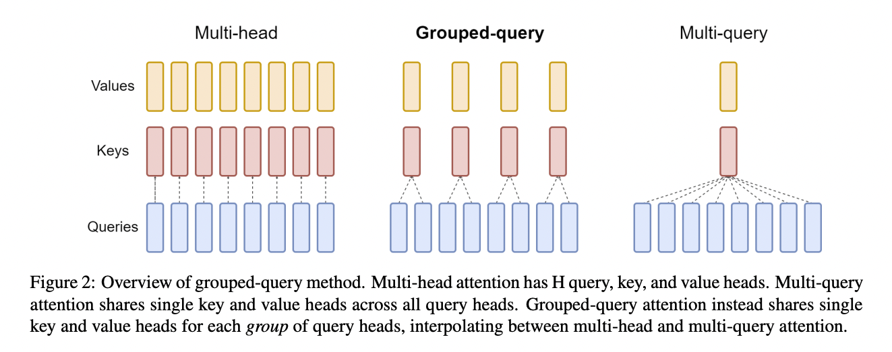
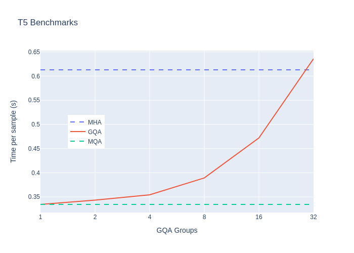
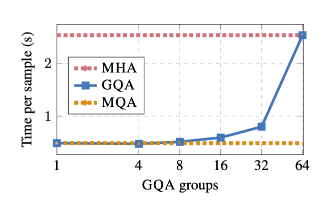

# grouped-query-attention-pytorch

(Unofficial) PyTorch implementation of grouped-query attention (GQA) from [GQA: Training Generalized Multi-Query Transformer Models from Multi-Head Checkpoints](https://arxiv.org/pdf/2305.13245.pdf)



### Includes:
- [x] scaled dot-product attention with GQA support. (See: [scaled_dot_product_gqa usage](#scaled_dot_product_gqa))
- [x] GQA multi-head attention layer.  (See: [MultiheadGQA usage](#multiheadgqa))
- [x] Code to convert pretrained T5 model to use GQA.   (See: [T5 usage](#t5) )
- [x] Prototype (untrained) GQA encoder-decoder models: `GQATransformer`, `GQATransformerLM`  (See: [GQATransformer )usage](#gqatransformer))
- [x] Reproduce runtime benchmarks from [GQA paper](https://arxiv.org/pdf/2305.13245.pdf), figure 6  (See: [scripts/)README.md](scripts/README.md))

### To do:
- [ ] Fine-tuning code for T5 GQA models
- [ ] Reproduce fine-tuning results from [GQA paper](https://arxiv.org/pdf/2305.13245.pdf), figures 3,5

## Install

PyPI: (NOT YET AVAILABLE)
```bash
pip install grouped-query-attention-pytorch
```

From source:
```bash
pip install "grouped-query-attention-pytorch @ git+ssh://git@github.com/fkodom/grouped-query-attention-pytorch.git"
```

For contributors:
```bash
# Install all dev dependencies (tests, T5 support, etc.)
pip install "grouped-query-attention-pytorch[test,t5] @ git+ssh://git@github.com/fkodom/grouped-query-attention-pytorch.git"
# Setup pre-commit hooks
pre-commit install
```


## Benchmark

I attempt to reproduce the runtime benchmarks from the [GQA paper](https://arxiv.org/pdf/2305.13245.pdf) (Figure 6).  Unfortunately, I don't have access to the same hardware, so the comparison isn't perfect. (They use multiple high-end GPUs, and I use a single 2080 Ti.)  Even with different hardware, though, it is clear that runtime scales similarly with the number of GQA groups.

For more details, see [scripts/README.md](scripts/README.md#benchmark_t5)

> Left: This repo <br> Right: Original paper
<p float="left">


</p>


## Usage

### `scaled_dot_product_gqa`

See: [attention.py](grouped_query_attention_pytorch/attention.py)

Intended to be a drop-in replacement for `F.scaled_dot_product_attention` with support for GQA. 

> **NOTE**:  The built-in `F.scaled_dot_product_attention` will be *much* faster when you're **not** using grouped queries -- especially for `torch>=2.0`, which uses [flash attention](https://github.com/Dao-AILab/flash-attention) under the hood.  However, [this benchmark](./scripts/README.md#benchmark_attention) shows that naie `scaled_dot_product_gqa` is faster than flash attention when the number of GQA groups is small. 🔥

```python
import torch

from grouped_query_attention_pytorch.attention import scaled_dot_product_gqa

# shapes: (batch_size, seq_len, num_heads, head_dim)
query = torch.randn(1, 256, 8, 64, device="cuda", dtype=torch.float16)
key = torch.randn(1, 128, 2, 64, device="cuda", dtype=torch.float16)
value = torch.randn(1, 128, 2, 64, device="cuda", dtype=torch.float16)

out, attn_weights = scaled_dot_product_gqa(
    query,
    key,
    value,
    is_causal=True,  # default: False
    need_weights=True,  # default: False, which returns 'attn_weights=None'
)
print(out.shape)  # (batch_size, q_seq_len, kv_heads, embed_dim)
# torch.Size([1, 256, 2, 64])
print(attn_weights.shape)  # (batch_size, q_seq_len, kv_seq_len, kv_heads)
# torch.Size([1, 256, 128, 2])
```


### `MultiheadGQA`

See: [attention.py](grouped_query_attention_pytorch/attention.py)

Intended to be a drop-in replacement for `nn.MultiheadAttention` with support for GQA.

> **NOTE**: The same performance advice from [scaled_dot_product_gqa](#scaled_dot_product_gqa) (above) applies here as well.

```python
from grouped_query_attention_pytorch.attention import MultiheadGQA

mha = MultiheadGQA(
    embed_dim=512, query_heads=8, kv_heads=2, device="cuda", dtype=torch.float16
)

# shapes: (batch_size, seq_len, embed_dim)
query = torch.randn(1, 256, 512, device="cuda", dtype=torch.float16)
key = torch.randn(1, 128, 512, device="cuda", dtype=torch.float16)
value = torch.randn(1, 128, 512, device="cuda", dtype=torch.float16)

out, attn_weights = mha(
    query,
    key,
    value,
    is_causal=True, # default: False
    need_weights=True, # default: False, which returns 'attn_weights=None'
)
print(out.shape)  # (batch_size, q_seq_len, embed_dim)
# torch.Size([1, 256, 512])
print(attn_weights.shape)  # (batch_size, q_seq_len, kv_seq_len, kv_heads)
# torch.Size([1, 256, 128, 2])
```


### T5

See: [t5.py](grouped_query_attention_pytorch/t5.py)

Convert a pretrained T5 model from [huggingface/transformers](https://github.com/huggingface/transformers) to use GQA.  The resulting model can be used and trained with the Huggingface Transformers library, just like an ordinary T5 model.

```python
from transformers import T5ForConditionalGeneration, T5Tokenizer

from grouped_query_attention_pytorch.t5 import convert_t5_to_gqa

# Initialize a pre-trained T5 model
t5 = T5ForConditionalGeneration.from_pretrained("t5-small")
tokenizer = T5Tokenizer.from_pretrained("t5-small", legacy=False)
# Convert attention layers to GQA
t5_gqa = convert_t5_to_gqa(t5, kv_heads=2, inplace=False)  # default: inplace=False

# Generate some text with the converted model
input_ids = tokenizer(
    "translate English to German: The house is wonderful.", return_tensors="pt"
).input_ids
outputs = t5_gqa.generate(input_ids, max_new_tokens=25)
text = tokenizer.batch_decode(outputs[0], skip_special_tokens=True)
print(text)
# The correct answer is:  ['<pad>', 'Das', 'Haus', 'ist', 'wunderbar', '.', '</s>']
# NOTE: The original T5 model produces this answer, and so does GQA when we use the
# maximum number of KV heads (kv_heads=8 in this example), which effectively makes
# GQA equivalent to the original T5 model with MHA.  The text quickly degrades as
# we reduce the number of heads.
```

### GQATransformer

I also provide a prototype implementation of an (untrained) encoder-decoder Transformer model, which uses GQA instead of MHA.  This is mostly for reference/educational purposes, but in principle it could be used as a drop-in replacement for `nn.Transformer`.

See: [transformer.py](grouped_query_attention_pytorch/transformer.py)

```python
from grouped_query_attention_pytorch.transformer import GQATransformer, GQATransformerLM

device = torch.device("cuda")
dtype = torch.float16

net = GQATransformer(
    d_model=512,  # required
    nhead=8,  # required
    kv_heads=2,  # required
    num_encoder_layers=6,
    num_decoder_layers=6,
    dim_feedforward=2048,
    dropout=0.1,
    activation="relu",
    layer_norm_eps=1e-5,
    device=device,
    dtype=dtype,
)
# shape: (batch_size, seq_len, d_model)
x = torch.randn(1, 256, 512, device=device, dtype=dtype)
with torch.no_grad():
    y = net.forward(x, is_causal=True)  # default: is_causal=True
print(y.shape)
# torch.Size([1, 256, 512])

num_tokens = 10000  # usually obtained from the tokenizer
lm = GQATransformerLM(
    num_tokens=num_tokens,  # required
    d_model=512,  # required
    nhead=8,  # required
    kv_heads=2,  # required
    num_encoder_layers=6,
    num_decoder_layers=6,
    dim_feedforward=2048,
    dropout=0.1,
    activation="relu",
    layer_norm_eps=1e-5,
    device=device,
    dtype=dtype,
)
# shape: (batch_size, seq_len)
x = torch.randint(0, num_tokens, (1, 256), device=device, dtype=torch.long)
with torch.no_grad():
    y = lm.forward(x, is_causal=True)  # default: is_causal=True
print(y.shape)
# torch.Size([1, 256, num_tokens])
```
