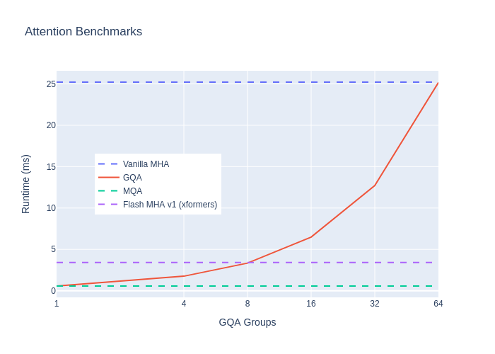

# scripts

Scripts should be launched from the root of this repository.  Ex:

```bash
python -m scripts.benchmark_attention
```


## benchmark_attention

Gather runtime benchmarks for scaled dot product attention with grouped queries.  In particular, we want to see how the runtime scales with the number of queries.  We compare vanilla (naive) attention compares to grouped attention.  We also compare against `xformers.ops.memory_efficient_attention` as a strong baseline.

### Reference
The original paper benchmarks end-to-end runtime of the T5 model (https://arxiv.org/pdf/2305.13245v1.pdf, Figure 6).  We do that in a separate benchmark (see `scripts/benchmark_t5.py`).  Here, we focus on the attention layer itself.

### Results

Clearly, runtime scales similarly with the number of GQA groups.  

Even through `xformers` is much faster than the naive implementation, GQA is still faster when the number of groups is small.  Hopefully, someone will write an efficient CUDA implementation for GQA, so we can get the best of both worlds.  Unfortunately, I likely don't have the CUDA experience to do it myself. :(

#### This repo (attention layer only)



#### Original paper (end-to-end T5)


## benchmark_t5

Similar to [benchmark_attention](#benchmark_attention) above, but we benchmark the end-to-end T5 model.  We compare the original T5 implementation with MHA to T5 with converted GQA.  

The same hardware differences apply as above.  The original paper benchmarked T5-XXL (11B params), which does not fit in my GPU memory.  Instead, I benchmark T5-3B, which is the largest T5 variant that will fit in memory.  T5-3B only has 32 attention heads, so my benchmarks only go up to 32 GQA groups.  (The original benchmarks with T5-XXL go up to 64 groups.)  I use an input sequence length of 512 (similar to training) and a batch size of 8 (original uses 32).

### Reference
https://arxiv.org/pdf/2305.13245v1.pdf, Figure 6

### Results

Again, it's clear that runtime scales similarly with the number of GQA groups.

#### This repo


#### Original paper


